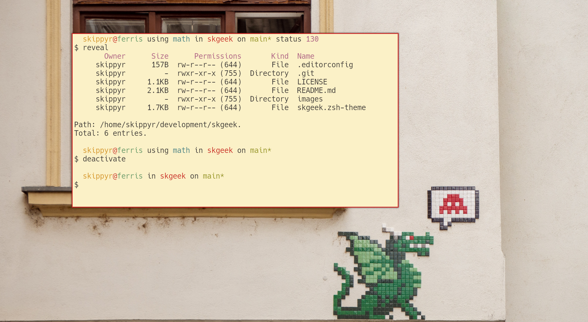

# Skgeek

## Starting Point

The Skgeek project is a simple dual-line theme for the ZSH shell that focus on
giving compatility to old terminal emulators, that can not render pretty
symbols.

This theme can be setup with a series of terminal emulators, themes and
wallpapers. You can use following preview as a source of inspiration and
reference to see what it can look like:



> In this preview, the Skgeek theme was used within the [Kitty terminal emulator](https://github.com/kovidgoyal/kitty)
with the [Gruvbox Light theme](https://github.com/kovidgoyal/kitty-themes/blob/master/themes/gruvbox-light.conf).
Font used is Hack Nerd Font. Wallpaper is [A window with a sign on it by Robert Katzki](https://unsplash.com/photos/zzqw25Oa51A) from Unsplash.

## Features

This theme can show you the following information:

* Your user and hostname.
* The name of sourced virtual environments.
* Your current directory.
* If inside a Git repository, the name of the branch and if there are changes
  to be commited.
* The exit code of failed commands.

## Dependencies

This theme has some dependencies that you need to download before installing it.

* git

    This is the terminal utility used to obtain information about your Git
    repositories.

## Installation

You can install this theme in multiple ways, use the one that suits you best.

### Manually

* Run the following command to install the theme at
  `~/.local/share/zsh/themes/skgeek`.

    ```bash
    git clone --depth=1 https://github.com/skippyr/skgeek ~/.local/share/zsh/themes/skgeek &&
    echo "source \"${HOME}/.local/share/zsh/themes/skgeek/skgeek.zsh-theme\"" >> ~/.zshrc
    ```

* Reopen your terminal emulator.

### Within OhMyZSH

* Install the theme in OhMyZSH custom themes' directory.

    ```bash
    git clone --depth=1 https://github.com/skippyr/skgeek ${ZSH_CUSTOM:-${HOME}/.oh-my-zsh/custom}/themes/skgeek
    ```

* Change the value of the `ZSH_THEME` variable in your ZSH configuration file,
  `~/.zshrc`, to use the theme.

    ```bash
    ZSH_THEME="skgeek/skgeek"
    ```

* Reopen your terminal emulator.

## Issues And Contributions

Learn how to report issues and contribute to this project by reading its
[contributions guidelines](https://skippyr.github.io/materials/pages/contributions_guidelines.html).

## License

This project is released under the terms of the MIT license. A copy of the
license is bundled with the source code.

Copyright (c) 2023, Sherman Rofeman. MIT license.