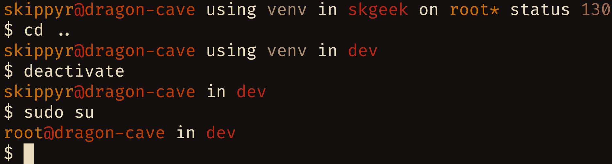

# Skgeek
## About
A simple theme for the ZSH shell.


## Installation
### Dependencies
-	git

### Procedures
-	Clone this repository.
```bash
git\
   clone --depth=1 https://github.com/skippyr/skgeek\
   ~/.local/share/zsh/themes/skgeek
```

-	Add the following source command in your `~/.zshrc` file. Ensure that you are not sourcing any other theme.
```bash
source ~/.local/share/zsh/themes/skgeek/skgeek.zsh-theme
```

-	Reopen ZSH.

## Copyright
Copyright (c) Sherman Rofeman. MIT license.
